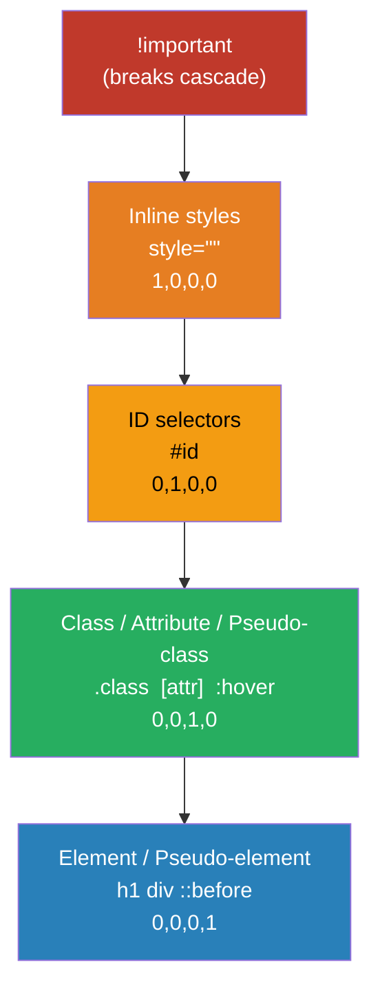
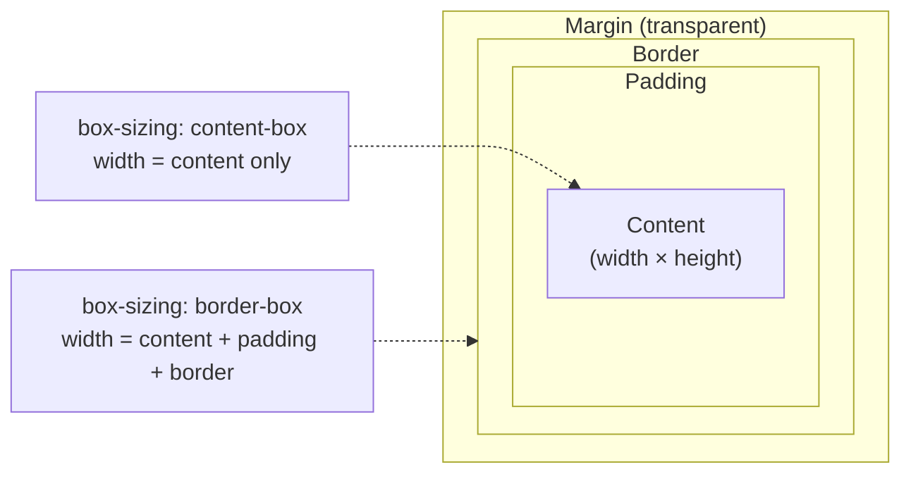

# CSS3 — Core Concepts

## 1. Box Model & box-sizing

Every HTML element is rendered as a rectangular box composed of four layers: content, padding, border, and margin. `box-sizing: border-box` causes `width` and `height` to include padding and border, making layout math predictable. WordPress themes universally apply `*, *::before, *::after { box-sizing: border-box }` as a reset.

```css
/* Modern reset — applied in most WordPress themes */
*,
*::before,
*::after {
  box-sizing: border-box;
}

.card {
  width: 300px;        /* includes padding + border */
  padding: 1.5rem;
  border: 2px solid #ccc;
  margin: 1rem;
}
```

---

## 2. Flexbox

Flexbox is a one-dimensional layout model that distributes space along a main axis (row or column) and aligns items on the cross axis. It excels at navigation bars, card rows, centering, and any UI where items share a single axis. Gutenberg toolbar components use Flexbox internally for icon alignment.

```css
.nav {
  display: flex;
  flex-direction: row;
  justify-content: space-between; /* main axis */
  align-items: center;            /* cross axis */
  gap: 1rem;
  flex-wrap: wrap;
}

.nav__item {
  flex: 0 1 auto; /* grow shrink basis */
}
```

---

## 3. CSS Grid

CSS Grid is a two-dimensional layout system that controls rows and columns simultaneously. The `fr` unit distributes free space proportionally; `repeat()`, `minmax()`, and `auto-fit` enable fully responsive grids without media queries. The Gutenberg block editor renders its canvas using a CSS Grid-based layout system.

```css
.blog-layout {
  display: grid;
  grid-template-columns: repeat(auto-fit, minmax(280px, 1fr));
  grid-template-rows: auto;
  gap: 2rem;
}

.featured-post {
  grid-column: 1 / -1; /* full width */
}
```

---

## 4. Custom Properties (CSS Variables)

Custom properties (`--name: value`) are resolved at runtime in the browser, making them dynamic in ways Sass variables cannot match. They are scoped to the DOM subtree they are declared on and can be read and written via JavaScript. WordPress Full Site Editing generates theme.json styles as CSS custom properties for colors, spacing, and typography across blocks.

```css
:root {
  --color-primary: #0073aa;
  --spacing-base: 1rem;
  --font-size-lg: clamp(1.125rem, 2.5vw, 1.5rem);
}

.button {
  background: var(--color-primary);
  padding: var(--spacing-base) calc(var(--spacing-base) * 2);
  font-size: var(--font-size-lg, 1.25rem); /* fallback */
}
```

---

## 5. Specificity & Cascade

Specificity is calculated as a four-component score: inline styles (1,0,0,0), IDs (0,1,0,0), classes/attributes/pseudo-classes (0,0,1,0), elements/pseudo-elements (0,0,0,1). When specificity ties, the rule that appears later in source order wins. The cascade also considers origin — author styles override user agent defaults. `!important` breaks the normal flow and should be avoided except for utility overrides.

```css
/* Specificity scores shown as comments */
h1              { color: black; }   /* 0,0,0,1 */
.title          { color: navy; }    /* 0,0,1,0 */
#hero .title    { color: blue; }    /* 0,1,1,0 */
[data-theme] h1 { color: teal; }    /* 0,0,1,1 */

/* Avoid: breaks cascade reasoning */
.override { color: red !important; }
```

---

## 6. Pseudo-classes & Pseudo-elements

Pseudo-classes select elements based on state or position (`:hover`, `:focus`, `:nth-child()`, `:not()`, `:is()`, `:where()`). Pseudo-elements create virtual sub-elements that do not exist in the DOM (`::before`, `::after`, `::placeholder`, `::selection`, `::first-line`). Gutenberg uses `::before` and `::after` for decorative block separators and focus rings.

```css
/* Pseudo-class: state-based */
.button:hover,
.button:focus-visible {
  outline: 3px solid var(--color-primary);
  outline-offset: 2px;
}

/* Pseudo-element: generated content */
.section-title::before {
  content: '';
  display: block;
  width: 3rem;
  height: 4px;
  background: var(--color-primary);
  margin-bottom: 0.75rem;
}
```

---

## 7. Transitions & Animations (@keyframes)

`transition` interpolates a property between two states triggered by a state change (hover, focus, class toggle). `animation` runs a multi-step sequence defined by `@keyframes` and can loop, reverse, and run automatically. For performance, animate only `transform` and `opacity` — these are composited on the GPU and do not trigger layout or paint.

```css
/* Transition: hover state change */
.card {
  transform: translateY(0);
  transition: transform 200ms ease, box-shadow 200ms ease;
}
.card:hover {
  transform: translateY(-4px);
  box-shadow: 0 8px 24px rgb(0 0 0 / 0.15);
}

/* Animation: keyframe sequence */
@keyframes fade-in {
  from { opacity: 0; transform: translateY(8px); }
  to   { opacity: 1; transform: translateY(0); }
}
.hero { animation: fade-in 400ms ease forwards; }
```

---

## 8. Responsive Design & Media Queries

Media queries apply styles conditionally based on viewport characteristics. Mobile-first design uses `min-width` breakpoints, starting with base styles for small screens and adding complexity upward. WordPress block themes define breakpoints in `theme.json` and use `@media` queries in generated stylesheet output.

```css
/* Mobile-first: base styles apply to all */
.grid {
  display: grid;
  grid-template-columns: 1fr;
  gap: 1rem;
}

@media (min-width: 768px) {
  .grid { grid-template-columns: repeat(2, 1fr); }
}

@media (min-width: 1200px) {
  .grid { grid-template-columns: repeat(3, 1fr); }
}
```

---

## 9. BEM Naming Convention

BEM (Block__Element--Modifier) creates a flat, predictable naming system where every selector has the same specificity (single class). Blocks are standalone components, elements are parts of a block, and modifiers represent state or appearance variants. WordPress themes including Twenty Twenty-Four use BEM-like naming for their block styles.

```css
/* Block */
.card { }

/* Elements */
.card__image { }
.card__body  { }
.card__title { }
.card__meta  { }

/* Modifiers */
.card--featured { background: var(--color-accent); }
.card--compact  { padding: 0.75rem; }
.card__title--large { font-size: 1.5rem; }
```

---

## 10. Modern Layout: Container Queries

Container queries (`@container`) allow styles to respond to a parent element's size rather than the viewport, enabling truly reusable components. A containment context is established with `container-type: inline-size`. This is ideal for components used in multiple layout contexts — a card that adapts whether it is in a sidebar or a full-width grid. WordPress 6.4+ supports container queries in block themes.

```css
.card-wrapper {
  container-type: inline-size;
  container-name: card;
}

.card__body { flex-direction: column; }

@container card (min-width: 400px) {
  .card__body {
    flex-direction: row;
    align-items: center;
  }
}
```

---

## 11. Stacking Context & z-index

A stacking context is an independent layer in the rendering order. Properties like `position` + `z-index`, `opacity < 1`, `transform`, `filter`, `will-change`, and `isolation: isolate` create new stacking contexts. `z-index` only compares elements within the same stacking context. Understanding this prevents common z-index "wars" in complex layouts like modal overlays in block editors.

```css
/* Create isolated stacking context */
.modal-overlay {
  position: fixed;
  inset: 0;
  z-index: 1000;
  isolation: isolate; /* new stacking context */
}

/* Prevent accidental z-index leaks */
.card {
  position: relative;
  z-index: 1; /* only competes within its parent context */
}
```

---

## 12. CSS Positions (static / relative / absolute / fixed / sticky)

`static` is the default flow position. `relative` offsets an element from its normal position without removing it from flow, and creates a containing block for absolute children. `absolute` removes the element from flow and positions it relative to the nearest non-static ancestor. `fixed` positions relative to the viewport. `sticky` toggles between relative and fixed at a scroll threshold.

```css
.parent {
  position: relative; /* containing block for absolute child */
}

.badge {
  position: absolute;
  top: -0.5rem;
  right: -0.5rem;
}

.site-header {
  position: sticky;
  top: 0;
  z-index: 100;
}
```

---

## 13. CSS @layer (Cascade Layers)

`@layer` groups styles into explicitly ordered cascade layers, making specificity between design systems, third-party libraries, and component styles predictable. Styles in later-declared layers win over earlier ones regardless of selector specificity. WordPress plugins and block themes benefit from layers to avoid specificity conflicts between core styles and customizations.

```css
@layer reset, base, components, utilities;

@layer reset {
  * { margin: 0; padding: 0; box-sizing: border-box; }
}

@layer base {
  body { font-family: system-ui, sans-serif; }
}

@layer components {
  .button { padding: 0.5rem 1rem; border-radius: 4px; }
}

@layer utilities {
  .mt-auto { margin-top: auto; }
}
```

---

## 14. :has() Selector

`:has()` is a relational pseudo-class that selects an element based on its descendants — effectively a "parent selector." It is the first CSS feature that allows styling parents based on child state. In WordPress, `:has()` can style a block container differently when it contains a specific child block type.

```css
/* Style a card that contains an image */
.card:has(img) {
  padding-top: 0;
}

/* Form row that contains a required input */
.form-row:has(input:required) .form-label::after {
  content: ' *';
  color: red;
}

/* Navigation with open submenu */
.nav-item:has(.submenu:hover) > .nav-link {
  color: var(--color-primary);
}
```

---

## 15. CSS clamp() & Fluid Typography

`clamp(min, preferred, max)` returns a value that is constrained between a minimum and maximum. When combined with viewport units (`vw`) in the preferred value, it produces fluid scaling without breakpoints. WordPress FSE theme.json uses `clamp()` for fluid font sizes and spacing across its global styles.

```css
/* Fluid type: scales smoothly between viewport sizes */
:root {
  --text-sm:   clamp(0.875rem, 1.5vw, 1rem);
  --text-base: clamp(1rem,     2vw,   1.25rem);
  --text-lg:   clamp(1.25rem,  3vw,   2rem);
  --text-xl:   clamp(1.75rem,  5vw,   3.5rem);
}

h1 { font-size: var(--text-xl); }
p  { font-size: var(--text-base); line-height: 1.6; }
```

---

## 16. Logical Properties

Logical properties replace physical directions (top/right/bottom/left) with writing-mode-relative equivalents (`block` = vertical axis, `inline` = horizontal axis). This enables layouts to adapt automatically to right-to-left (RTL) languages like Arabic and Hebrew. WordPress 6.1+ generates logical properties for block spacing to support international sites.

```css
.content {
  /* Physical → Logical equivalents */
  margin-inline: auto;          /* margin-left + margin-right */
  padding-block: 2rem;          /* padding-top + padding-bottom */
  padding-inline: 1.5rem;       /* padding-left + padding-right */
  border-inline-start: 4px solid var(--color-primary); /* left in LTR, right in RTL */
  inset-block-start: 0;         /* top */
}
```

---

## 17. CSS aspect-ratio

`aspect-ratio` sets an element's preferred width-to-height ratio. The browser maintains this ratio when only one dimension is explicitly set. This replaces the old "padding-top hack" for responsive embeds. WordPress uses `aspect-ratio` in the Cover and Video blocks to maintain proportions across screen sizes.

```css
/* Responsive video embed */
.video-embed {
  aspect-ratio: 16 / 9;
  width: 100%;
}

/* Square avatar thumbnails */
.avatar {
  aspect-ratio: 1;
  width: 3rem;
  border-radius: 50%;
  object-fit: cover;
}

/* Card image with consistent crop */
.card__image { aspect-ratio: 4 / 3; object-fit: cover; }
```

---

## 18. will-change & GPU Compositing

`will-change` hints to the browser that an element will be animated, allowing it to promote the element to its own compositor layer before the animation begins — avoiding jank on first frame. Use sparingly: each layer consumes GPU memory. Only apply immediately before an animation and remove afterward when possible.

```css
/* Apply before animation starts */
.dropdown {
  will-change: transform, opacity;
  transition: transform 250ms ease, opacity 250ms ease;
}

/* Properties that trigger compositing without will-change */
.composited {
  transform: translateZ(0); /* legacy GPU hack — prefer will-change */
}

/* Remove after animation to free memory */
.dropdown.is-settled {
  will-change: auto;
}
```

---

## 19. CSS transform 2D & 3D

`transform` applies geometric transformations without affecting document flow or triggering layout. 2D functions: `translate()`, `scale()`, `rotate()`, `skew()`. 3D functions: `translateZ()`, `rotateX()`, `rotateY()`, `perspective()`. Transforms are composited on the GPU when combined with animation, making them the preferred property for performant motion.

```css
.card {
  transform-origin: center;
  transition: transform 200ms ease;
}
.card:hover { transform: scale(1.03) translateY(-4px); }

/* 3D flip effect */
.flip-card { perspective: 800px; }
.flip-card__inner {
  transform-style: preserve-3d;
  transition: transform 600ms ease;
}
.flip-card:hover .flip-card__inner {
  transform: rotateY(180deg);
}
```

---

## 20. @media print Styles

Print media queries (`@media print`) allow a separate visual treatment when users print a page. Best practices include hiding navigation, sidebars, and interactive elements; expanding link URLs; using black text on white; and avoiding page breaks inside content blocks. WordPress themes should include print styles to ensure posts and pages print cleanly.

```css
@media print {
  .site-header,
  .site-footer,
  .sidebar,
  .comments-area {
    display: none;
  }

  body { font: 12pt Georgia, serif; color: #000; }
  a::after { content: ' (' attr(href) ')'; font-size: 0.8em; }
  h2, h3 { page-break-after: avoid; }
  p, blockquote { orphans: 3; widows: 3; }
}
```

---

## 21. CSS Scroll Snap

Scroll snap enforces alignment points during scrolling, creating a controlled, paginated scrolling experience without JavaScript. The container sets `scroll-snap-type` and children declare `scroll-snap-align`. Useful for image galleries, carousels, and full-screen sections. WordPress media carousel blocks can leverage scroll snap for accessible, smooth behavior.

```css
/* Horizontal snap carousel */
.carousel {
  display: flex;
  overflow-x: auto;
  scroll-snap-type: x mandatory;
  scroll-behavior: smooth;
  gap: 1rem;
  -webkit-overflow-scrolling: touch;
}

.carousel__slide {
  flex: 0 0 100%;
  scroll-snap-align: start;
}
```

---

## 22. color-mix() & oklch()

`color-mix()` blends two colors in a specified color space — replacing manual Sass color functions at the CSS level. `oklch()` is a perceptually uniform color space (lightness, chroma, hue) where equal numeric changes produce equal perceived differences, enabling better accessibility-safe color manipulation. WordPress 6.5+ theme.json color palette generation benefits from these modern color functions.

```css
:root {
  --color-base: oklch(55% 0.18 240);

  /* Tints and shades via color-mix */
  --color-light: color-mix(in oklch, var(--color-base) 30%, white);
  --color-dark:  color-mix(in oklch, var(--color-base) 70%, black);

  /* Semi-transparent */
  --color-ghost: color-mix(in srgb, var(--color-base) 15%, transparent);
}
```

---

## 23. content-visibility & contain

`content-visibility: auto` instructs the browser to skip rendering off-screen content entirely, dramatically improving initial paint time on long pages. `contain: layout paint style` restricts how changes propagate — the browser knows a contained element cannot affect or be affected by the rest of the document. Both are critical performance properties for WordPress archive pages with many blocks.

```css
/* Skip rendering off-screen sections */
.wp-block-group {
  content-visibility: auto;
  contain-intrinsic-size: 0 500px; /* placeholder height estimate */
}

/* Isolate a widget from layout recalculation */
.sidebar-widget {
  contain: layout paint style;
}
```

---

## 24. CSS @property (Houdini)

`@property` registers a custom property with a type, syntax, and initial value, enabling the browser to interpolate it in transitions and animations — something plain `var()` cannot do. This is part of the CSS Houdini API. It enables animated gradients, typed tokens, and safer design systems where invalid values are caught by the browser.

```css
@property --gradient-angle {
  syntax: '<angle>';
  initial-value: 0deg;
  inherits: false;
}

.animated-gradient {
  background: conic-gradient(from var(--gradient-angle), #0073aa, #00b9f1);
  animation: rotate-gradient 4s linear infinite;
}

@keyframes rotate-gradient {
  to { --gradient-angle: 360deg; }
}
```

---

## 25. Subgrid

`subgrid` allows a grid item to participate in its parent grid's track definitions, solving the longstanding problem of aligning nested content to the outer grid. When `grid-template-columns: subgrid` is set on a child, its own children line up with the parent's column tracks. This is invaluable for card grids where titles and meta must align across cards of varying content length in WordPress post grids.

```css
.card-grid {
  display: grid;
  grid-template-columns: repeat(3, 1fr);
  grid-template-rows: auto;
  gap: 2rem;
}

.card {
  display: grid;
  grid-row: span 4;
  grid-template-rows: subgrid; /* inherit parent row tracks */
}

/* All cards: image / title / body / footer always align */
.card__image  { grid-row: 1; }
.card__title  { grid-row: 2; }
.card__body   { grid-row: 3; }
.card__footer { grid-row: 4; }
```

---

## Mermaid Diagrams

### CSS Specificity Hierarchy



### CSS Box Model Layers


