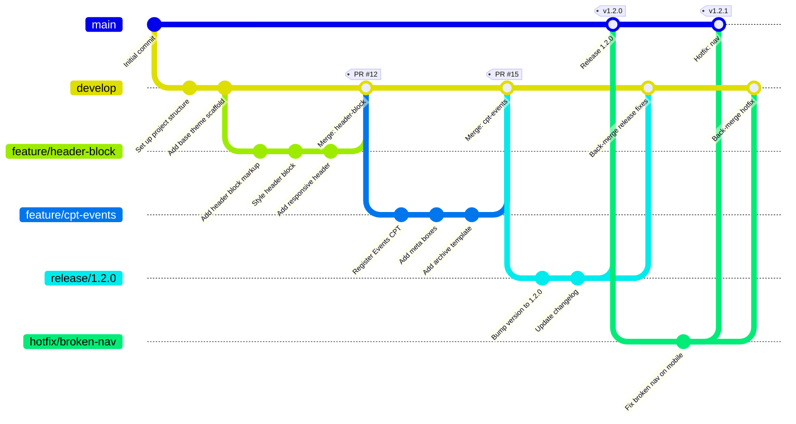

# Git — Core Concepts



## 1. Git Data Model

Git stores snapshots, not diffs. Every object is content-addressed by a SHA-1 (soon SHA-256) hash.

### Object types

| Type | Description |
|---|---|
| **Blob** | Raw file content (no filename, no metadata) |
| **Tree** | Directory: maps names to blobs or other trees |
| **Commit** | Snapshot pointer: tree hash + parent(s) + author + message |
| **Tag** | Named reference to a commit (or any object) |

### How a commit is structured

```
commit a3f9d2
├── tree  8b1a4c          ← root directory snapshot
│   ├── blob index.php
│   ├── blob style.css
│   └── tree src/
│       └── blob main.js
├── parent 7e2f1b         ← previous commit
├── author Jane <j@x.com>
├── date   2025-01-15
└── message "Add hero block"
```

---

## 2. Branching Strategies

### GitFlow

Classic model with long-lived branches: `main`, `develop`, `release/*`, `hotfix/*`, `feature/*`.

```
main ──────────────────────────────────────────▶  (production tags)
        │              ▲               ▲
develop ┴──────────────┴───────────────┴──────▶
         \            /               /
feature   └──────────┘   release──────
                                 \
hotfix ───────────────────────────▶ main + develop
```

Pros: clear separation between production and development work.
Cons: long-lived branches accumulate merge debt; slow for CI/CD.

### Trunk-Based Development

Everyone commits to `main` (trunk) frequently. Short-lived feature branches (< 2 days) are merged via PR. Feature flags gate incomplete work.

Pros: minimal merge conflicts, pairs perfectly with CI/CD.
Cons: requires discipline and mature feature-flag infrastructure.

---

## 3. Merge vs Rebase vs Squash

| Operation | History | When to use |
|---|---|---|
| `merge` | Preserves all commits + adds a merge commit | Public branches, auditable history |
| `rebase` | Rewrites commits on top of target (linear) | Local cleanup before PR |
| `squash` | Collapses all PR commits into one | Clean main branch history |

```bash
# Merge (non-destructive, creates merge commit)
git checkout main && git merge feature/my-feature

# Rebase (rewrites feature history onto latest main)
git checkout feature/my-feature && git rebase main

# Squash merge (collapses feature into single commit on main)
git checkout main && git merge --squash feature/my-feature && git commit
```

---

## 4. Cherry-Pick

Apply a specific commit from another branch without merging the whole branch.

```bash
# Pick commit abc1234 and apply it to current branch
git cherry-pick abc1234

# Pick a range
git cherry-pick abc1234..def5678

# Pick without committing (stage only)
git cherry-pick --no-commit abc1234
```

Use cases: backporting a bugfix to a release branch, selectively applying changes.

---

## 5. Stash

Temporarily shelve uncommitted changes so you can switch context.

```bash
git stash                          # stash tracked changes
git stash push -u -m "WIP: login" # include untracked files, add label
git stash list                     # view all stashes
git stash pop                      # apply latest + delete stash entry
git stash apply stash@{2}          # apply specific stash (keep the entry)
git stash drop stash@{0}           # delete a specific stash
git stash branch feature/wip       # create a branch from a stash
```

---

## 6. `git bisect` — Regression Hunting

Binary search through commit history to find the commit that introduced a bug.

```bash
git bisect start
git bisect bad                     # current HEAD has the bug
git bisect good v1.4.0             # last known good tag

# Git checks out the midpoint commit — test it, then mark it:
git bisect good                    # or:
git bisect bad

# Repeat until Git reports: "abc1234 is the first bad commit"

git bisect reset                   # exit bisect mode, return to HEAD
```

Automate with a test script:

```bash
git bisect start
git bisect bad HEAD
git bisect good v1.4.0
git bisect run npm test            # auto-marks commits good/bad by exit code
```

---

## 7. `git reflog` — Your Safety Net

`reflog` records every time HEAD or a branch tip moves (commit, checkout, reset, merge, rebase). It is your undo button.

```bash
git reflog                         # show all HEAD movements
git reflog show feature/login      # show movements on a specific branch

# Recover lost commit after accidental reset
git reset --hard HEAD~5            # ← oops
git reflog                         # find the SHA before the reset
git reset --hard abc1234           # restore it
```

Reflogs are local and expire (default 90 days for reachable objects).

---

## 8. Git Hooks

Shell scripts in `.git/hooks/` that fire at lifecycle events. Use tools like **Husky** to share hooks across a team via `package.json`.

| Hook | Fires when | Common use |
|---|---|---|
| `pre-commit` | Before commit is created | Lint, format, run unit tests |
| `commit-msg` | After message is entered | Enforce conventional commit format |
| `pre-push` | Before push to remote | Run full test suite |
| `post-merge` | After a successful merge | Run `npm install` automatically |

```bash
# .git/hooks/pre-commit (chmod +x required)
#!/bin/sh
npm run lint || exit 1
```

With Husky:

```json
{
    "husky": {
        "hooks": {
            "pre-commit": "lint-staged",
            "commit-msg": "commitlint --edit $1"
        }
    }
}
```

---

## 9. Submodules

Submodules embed one Git repo inside another at a pinned commit.

```bash
git submodule add https://github.com/acme/wp-plugin libs/wp-plugin
git submodule update --init --recursive   # clone all submodules after fresh clone
git submodule update --remote             # pull latest from each submodule's tracked branch
```

Caveats: submodule SHA must be committed whenever you update; team members must run `--recursive` on clone. Consider **subtree** or npm packages as simpler alternatives.

---

## 10. Tags

Tags mark a specific point in history (usually a release).

| Type | Command | Stored |
|---|---|---|
| Lightweight | `git tag v1.0.0` | Just a pointer (no metadata) |
| Annotated | `git tag -a v1.0.0 -m "Release 1.0"` | Full object with tagger, date, message |

```bash
git tag -a v2.3.1 -m "Security patch"
git push origin v2.3.1            # push a single tag
git push origin --tags            # push all tags
git tag -d v2.3.1                 # delete local tag
git push origin --delete v2.3.1  # delete remote tag
```

Annotated tags are recommended for releases because they appear in `git describe` and carry metadata.

---

## 11. GitHub Actions Basics

GitHub Actions is a CI/CD platform built into GitHub. Workflows are YAML files in `.github/workflows/`.

Key concepts:

| Term | Meaning |
|---|---|
| **Workflow** | A YAML file defining the automation |
| **Event** | Trigger (`push`, `pull_request`, `schedule`, `workflow_dispatch`) |
| **Job** | A set of steps running on one runner |
| **Step** | An individual `run` command or `uses` action |
| **Action** | Reusable unit from the Marketplace or your own repo |
| **Runner** | The VM that executes the job (`ubuntu-latest`, `macos-latest`, etc.) |

```yaml
# .github/workflows/ci.yml
name: CI

on:
  push:
    branches: [ main ]
  pull_request:

jobs:
  lint-and-test:
    runs-on: ubuntu-latest
    steps:
      - uses: actions/checkout@v4
      - uses: actions/setup-node@v4
        with:
          node-version: '20'
          cache: 'npm'
      - run: npm ci
      - run: npm run lint
      - run: npm test
```

Secrets are stored in **Settings → Secrets** and referenced as `${{ secrets.MY_SECRET }}`.
