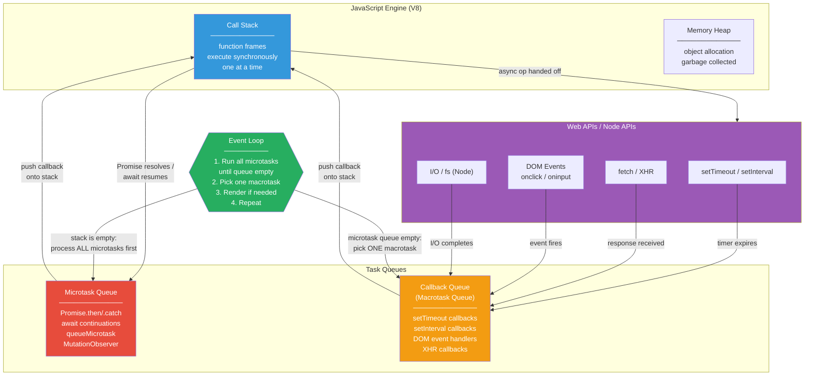

# JavaScript — Core Concepts

> Foundational JavaScript knowledge for Senior WordPress Engineer interviews.



---

## 1. Closures

A closure is a function that retains access to its outer (lexical) scope even after the outer function has returned. Closures are fundamental to JavaScript's module pattern, data encapsulation, and callback-based patterns common in WordPress themes and plugins.

```javascript
function makeCounter(start = 0) {
  let count = start; // enclosed variable
  return {
    increment: () => ++count,
    decrement: () => --count,
    value:     () => count,
  };
}
const counter = makeCounter(10);
counter.increment(); // 11
counter.value();     // 11
```

**Why it matters in WP:** jQuery's `$(document).ready()` callbacks, AJAX success handlers, and admin-notice dismissal logic all rely on closures.

---

## 2. Hoisting

Variable and function declarations are moved ("hoisted") to the top of their containing scope during the compile phase. `var` declarations are hoisted and initialised to `undefined`; `let`/`const` are hoisted but stay in the **Temporal Dead Zone (TDZ)** until the declaration line is reached.

```javascript
console.log(a); // undefined (var hoisted)
var a = 5;

console.log(b); // ReferenceError: Cannot access 'b' before initialization
let b = 10;

greet(); // works — function declarations are fully hoisted
function greet() { console.log('Hello'); }

sayBye(); // TypeError: sayBye is not a function
var sayBye = function() { console.log('Bye'); };
```

---

## 3. Event Loop

JavaScript is single-threaded. The event loop coordinates the **call stack**, **Web APIs**, **macrotask queue** (setTimeout, setInterval, I/O), and **microtask queue** (Promises, queueMicrotask). Microtasks always drain before the next macrotask.

```javascript
console.log('1 - sync');

setTimeout(() => console.log('2 - macrotask'), 0);

Promise.resolve()
  .then(() => console.log('3 - microtask'))
  .then(() => console.log('4 - microtask 2'));

console.log('5 - sync');
// Output: 1, 5, 3, 4, 2
```

**WP relevance:** Understanding this prevents bugs when mixing `wp.ajax` Deferred objects with native Promises inside Gutenberg blocks.

---

## 4. Promises & Async/Await

A `Promise` represents the eventual completion (or failure) of an asynchronous operation. `async/await` is syntactic sugar over Promises, making asynchronous code read like synchronous code while preserving non-blocking behaviour.

```javascript
// Fetching WP REST API posts
async function getLatestPosts(perPage = 5) {
  try {
    const res = await fetch(`/wp-json/wp/v2/posts?per_page=${perPage}`);
    if (!res.ok) throw new Error(`HTTP ${res.status}`);
    const posts = await res.json();
    return posts.map(({ id, title, link }) => ({ id, title: title.rendered, link }));
  } catch (err) {
    console.error('Failed to load posts:', err);
    return [];
  }
}
```

**Promise combinators:**
- `Promise.all()` — all resolve, or first rejection propagates
- `Promise.allSettled()` — waits for all regardless of outcome
- `Promise.race()` — first settled wins
- `Promise.any()` — first fulfilled wins

---

## 5. Prototypes & Prototype Chain

Every JavaScript object has an internal `[[Prototype]]` link. Property lookup traverses this chain until `null` is reached. `class` syntax is syntactic sugar over prototypal inheritance.

```javascript
function Animal(name) { this.name = name; }
Animal.prototype.speak = function() {
  return `${this.name} makes a noise.`;
};

function Dog(name) { Animal.call(this, name); }
Dog.prototype = Object.create(Animal.prototype);
Dog.prototype.constructor = Dog;
Dog.prototype.bark = function() { return `${this.name} barks.`; };

const d = new Dog('Rex');
d.speak(); // Rex makes a noise.
d.bark();  // Rex barks.
console.log(d instanceof Dog);    // true
console.log(d instanceof Animal); // true
```

---

## 6. ES6+ Features — Destructuring, Spread/Rest, Modules

**Destructuring** unpacks values from arrays or properties from objects.
**Spread** (`...`) expands iterables; **Rest** collects remaining elements.
**Modules** (`import`/`export`) provide static, tree-shakeable dependency graphs used by WordPress's `@wordpress/*` packages.

```javascript
// Destructuring with defaults and renaming
const { title: postTitle = 'Untitled', status = 'draft', meta: { views = 0 } = {} } = post;

// Spread — merge objects (last wins)
const updated = { ...defaultConfig, ...userConfig, timestamp: Date.now() };

// Rest parameters
function logAll(first, second, ...rest) {
  console.log(first, second, rest);
}

// ES Modules in Gutenberg block
import { registerBlockType } from '@wordpress/blocks';
import { __ } from '@wordpress/i18n';
export default function Edit({ attributes, setAttributes }) { /* … */ }
```

---

## 7. WeakMap & WeakRef

`WeakMap` holds *weak* references to object keys — if the key object is garbage-collected, the entry is removed automatically. Useful for associating metadata with DOM nodes without preventing GC. `WeakRef` wraps an object and allows it to be garbage-collected; use `deref()` to access it (returns `undefined` if collected).

```javascript
const cache = new WeakMap();

function processElement(el) {
  if (cache.has(el)) return cache.get(el);
  const result = expensiveComputation(el);
  cache.set(el, result);
  return result;
}
// When `el` is removed from the DOM and dereferenced, the cache entry is GC'd automatically.

// WeakRef example
let bigObject = { data: new Array(1e6).fill(0) };
const ref = new WeakRef(bigObject);
bigObject = null; // allow GC

// Later:
const obj = ref.deref();
if (obj) { /* still alive */ } else { /* collected */ }
```

---

## 8. Generators

Generator functions (`function*`) return an iterator. Execution pauses at each `yield` and resumes on the next `.next()` call. Useful for lazy sequences, custom iterators, and co-routine-style async flows (the precursor to async/await).

```javascript
function* range(start, end, step = 1) {
  for (let i = start; i < end; i += step) yield i;
}
[...range(0, 10, 2)]; // [0, 2, 4, 6, 8]

// Infinite ID generator
function* idGenerator(prefix = 'block') {
  let n = 1;
  while (true) yield `${prefix}-${n++}`;
}
const ids = idGenerator('wp-post');
ids.next().value; // "wp-post-1"
ids.next().value; // "wp-post-2"
```

---

## 9. Proxy & Reflect

`Proxy` wraps an object and intercepts fundamental operations (get, set, delete, etc.) via **traps**. `Reflect` provides the default behaviour for each trap and makes it easy to forward operations. Used in reactive frameworks (Vue 3 reactivity, MobX) and validation layers.

```javascript
function createValidatedPost(target) {
  return new Proxy(target, {
    set(obj, prop, value) {
      if (prop === 'status') {
        const valid = ['publish', 'draft', 'pending', 'private'];
        if (!valid.includes(value)) throw new TypeError(`Invalid status: ${value}`);
      }
      return Reflect.set(obj, prop, value);
    },
    get(obj, prop) {
      console.log(`Accessing: ${prop}`);
      return Reflect.get(obj, prop);
    },
  });
}

const post = createValidatedPost({ title: 'Hello', status: 'draft' });
post.status = 'publish'; // ok
post.status = 'deleted'; // TypeError: Invalid status: deleted
```

---

## 10. Optional Chaining & Nullish Coalescing

`?.` short-circuits and returns `undefined` when a property in the chain is `null` or `undefined`, preventing `TypeError`. `??` returns the right-hand side only when the left is `null` or `undefined` (unlike `||`, which also triggers on `0`, `''`, `false`).

```javascript
// Without optional chaining (old style)
const city = user && user.address && user.address.city;

// With optional chaining
const city    = user?.address?.city;
const zipCode = user?.address?.zipCode ?? 'N/A';
const firstTag = post?.tags?.[0]?.name ?? 'Uncategorized';

// Calling optional methods
const len = str?.trim()?.length ?? 0;

// WP REST API response processing
const featuredUrl = post?._embedded?.['wp:featuredmedia']?.[0]?.source_url ?? '/img/placeholder.jpg';
```
