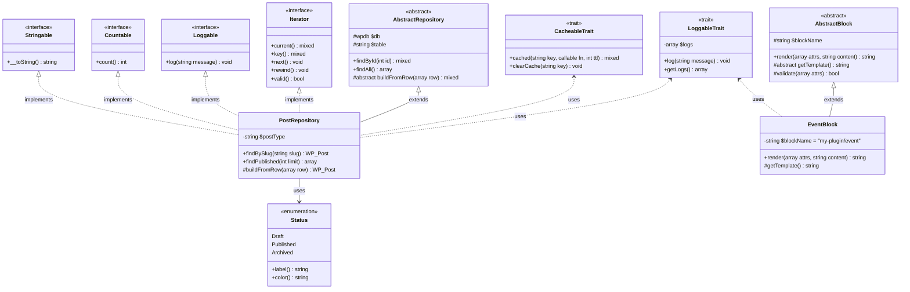

# PHP — Core Concepts



## 1. Type System and Type Declarations

PHP 8.x has a rich type system. Scalar types (`int`, `float`, `string`, `bool`), compound types (`array`, `callable`, `iterable`), and class types can all be declared for parameters, return values, and properties.

- **Union types** (PHP 8.0): `int|string`
- **Intersection types** (PHP 8.1): `Countable&Iterator`
- **Nullable types**: `?string` is shorthand for `string|null`
- **`never` return type** (PHP 8.1): function always throws or exits — never returns normally
- **`readonly` properties** (PHP 8.1): can only be written once, at initialization
- `strict_types=1` at the top of a file enforces strict type coercion rather than PHP's default loose coercion

---

## 2. Object-Oriented Programming Fundamentals

PHP's OOP model includes classes, abstract classes, interfaces, traits, and (PHP 8.1) enums.

- **Interfaces** — define a contract; a class implementing one must implement all methods.
- **Abstract classes** — can have concrete and abstract methods; cannot be instantiated directly.
- **Traits** — horizontal code reuse; avoids diamond inheritance problems. Conflicts resolved with `insteadof` and `as`.
- **Constructor promotion** (PHP 8.0): `public function __construct( private string $name ) {}` — declares and assigns in one step.
- **Enums** (PHP 8.1): backed (`enum Status: string`) or pure (`enum Direction`); can implement interfaces.

---

## 3. Design Patterns Relevant to WordPress/PHP

- **Singleton** — one instance per class. Used (controversially) for plugin main classes. Implement with a private constructor and a static `getInstance()` method.
- **Factory** — creates objects without specifying the concrete class. Useful for instantiating handlers based on configuration.
- **Observer / Hook System** — WordPress's entire hook architecture is a custom Observer pattern implementation.
- **Repository** — separates data-access logic from business logic. Encapsulates `WP_Query` / `$wpdb` calls behind an interface.
- **Decorator** — wraps an object to extend behavior without inheritance. Used for middleware layers.
- **Strategy** — selects an algorithm at runtime. E.g., selecting a payment gateway or shipping method.

---

## 4. Closures, Anonymous Functions, and Arrow Functions

- **Closures** — anonymous functions that can capture variables from the surrounding scope via `use`.
  ```php
  $multiplier = 3;
  $fn = function( int $n ) use ( $multiplier ): int {
      return $n * $multiplier;
  };
  ```
- **Arrow functions** (PHP 7.4) — `fn( $x ) => $x * 2`; automatically captures outer scope by value; cannot modify outer variables.
- Closures are instances of `Closure`. They can be bound to a different `$this` with `Closure::bind()` or `Closure::bindTo()`.
- First-class callables (PHP 8.1): `strlen(...)` returns a closure wrapping `strlen`.

---

## 5. Generators and Iterators

Generators use `yield` to produce values lazily, avoiding loading an entire result set into memory.

```php
function read_large_file( string $path ): Generator {
    $handle = fopen( $path, 'r' );
    while ( ! feof( $handle ) ) {
        yield fgets( $handle );
    }
    fclose( $handle );
}
```

- `yield from` delegates to another generator or iterable.
- `Generator::send()` passes a value back into the generator on the next `yield`.
- Use generators for processing large CSV exports, streaming API responses, or chunked database reads.

---

## 6. Error Handling and Exceptions

PHP 7+ merges fatal errors into the `Throwable` hierarchy. Both `Exception` and `Error` implement `Throwable`.

- **SPL exceptions**: `InvalidArgumentException`, `RuntimeException`, `LogicException`, `OverflowException`, etc. — choose the most specific one.
- **Custom exceptions**: extend `RuntimeException` or `DomainException` to add context.
- **`set_exception_handler()`** / **`set_error_handler()`** — register global handlers.
- **`finally` block** — always executes regardless of whether an exception was thrown.
- In WordPress, exceptions do not bubble up through the hook system — catch them inside callbacks; use `WP_Error` for returnable error objects.

---

## 7. Composer and Autoloading

Composer is the standard PHP dependency manager. `composer.json` defines dependencies, dev-dependencies, and autoloading rules.

- **PSR-4 autoloading**: maps namespace prefixes to directory paths. `composer dump-autoload` regenerates the autoloader.
- **classmap autoloading**: scans directories and builds a class map (useful for older code without namespaces).
- **`composer.lock`**: locks exact versions for reproducible installs. Always commit this file.
- **Scripts**: `composer test`, `composer lint` — run PHPUnit, PHPCS, etc.
- In WordPress plugins, include Composer's autoloader: `require_once __DIR__ . '/vendor/autoload.php';`

---

## 8. PHP 8.x Key Features

- **Named arguments** (8.0): `array_slice( array: $a, offset: 2, length: 3 )` — readable, order-independent.
- **Match expression** (8.0): strict, exhaustive switch alternative; each arm is an expression, not statements; no fallthrough.
- **Nullsafe operator** (8.0): `$user?->getProfile()?->getAvatar()` — short-circuits on null without nested null checks.
- **Fibers** (8.1): cooperative multitasking — pause and resume execution without threading.
- **`readonly` classes** (8.2): all properties are readonly by default.
- **`array_is_list()`** (8.1): checks if an array is a sequential, 0-indexed list.
- **`str_contains()`, `str_starts_with()`, `str_ends_with()`** (8.0): replaces strpos-based checks.

---

## 9. Performance Optimization

- **OPcache** — caches compiled bytecode. Configure `opcache.validate_timestamps=0` in production for maximum performance.
- **Avoid serialization hotspots** — `serialize()`/`unserialize()` on large structures is slow; prefer JSON for simple data.
- **String efficiency** — avoid concatenation in tight loops; use `implode()` on an array.
- **Memory management** — `unset()` large arrays when done; use generators for streaming data.
- **Preloading** (PHP 7.4+) — `opcache.preload` loads frequently used files into shared memory at server start.
- **JIT compiler** (PHP 8.0) — `opcache.jit_buffer_size` and `opcache.jit=tracing`. Most beneficial for CPU-bound workloads.

---

## 10. Security Best Practices

- **Never use `eval()`** — executes arbitrary code; almost always a vulnerability.
- **Prepared statements** — use PDO or MySQLi with placeholders; never interpolate user input into SQL.
- **`password_hash()` / `password_verify()`** — the only correct way to store passwords. Uses bcrypt by default; PHP 8.0 adds named algorithm constants.
- **`random_bytes()` / `random_int()`** — cryptographically secure random number generation.
- **Input validation** — filter with `filter_var()`, validate ranges, reject unexpected data early.
- **Output escaping** — escape for HTML (`htmlspecialchars()`), SQL (PDO), shell (`escapeshellarg()`), and URL (`rawurlencode()`).
- **Disable dangerous ini settings** — `allow_url_fopen`, `allow_url_include`, `expose_php` should be off in production.

---

## 11. PSR Standards

- **PSR-1**: Basic coding standard (class names PascalCase, constants UPPER_CASE).
- **PSR-2 / PSR-12**: Extended coding style (brace placement, spacing, visibility declarations).
- **PSR-4**: Autoloading standard.
- **PSR-3**: Logger interface (`LoggerInterface`, log levels).
- **PSR-7**: HTTP message interfaces (`RequestInterface`, `ResponseInterface`).
- **PSR-11**: Container interface for dependency injection.
- **PSR-14**: Event dispatcher interface — an abstraction over the Observer pattern.

WordPress uses its own coding standards (WPCS), which differ from PSR-2 in brace style and spacing. Know both.

---

## 12. Testing with PHPUnit

- **Unit tests** — test isolated units (functions/classes) with mocks for dependencies.
- **Integration tests** — test components together; the WP test suite bootstraps a real WordPress instance.
- **Mocking** — use PHPUnit's `createMock()` or Mockery for complex mock scenarios.
- **Data providers** — `@dataProvider` runs the same test with multiple input/output pairs.
- **Code coverage** — generated with Xdebug or PCOV; target critical paths first.
- WP-CLI scaffold: `wp scaffold plugin-tests my-plugin` sets up PHPUnit integration with the WordPress test library.
